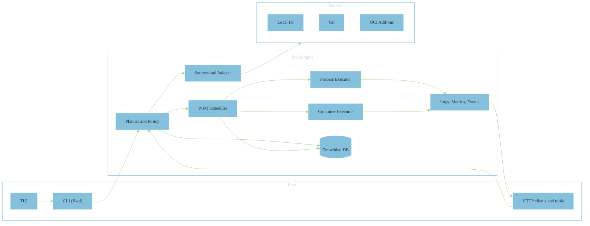
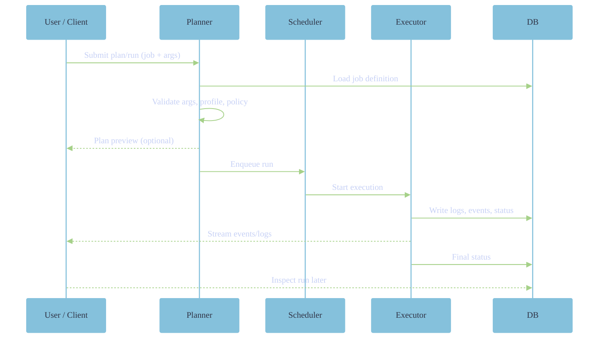

{}
The documentation may not be fully up to date. Please refer to the [disclaimer]() for important information about the project's active development status, documentation accuracy, and ongoing efforts to stabilize the codebase.
{}

This page describes the main components of flwd and how they interact. It is
intended as an accessible front door to the design, not a formal specification.

## High-level picture

flwd is a small, statically linked engine that turns job definitions into
planned and supervised runs. It can be used directly from the CLI, or as a
long-running server exposing a small HTTP/REST API.

At a glance:

- jobs are discovered from local trees, git repositories and OCI add-ons;
- the planner validates arguments, profiles and policies;
- the scheduler controls concurrency and fairness;
- executors run jobs as processes or containers;
- an embedded database stores jobs, runs and artifacts;
- logs, metrics and events are emitted for observability.

## Execution flow

A typical run goes through the following steps:

The same flow is used whether the request comes from the CLI, TUI or HTTP API.

## Core components

- **CLI (`flwd`)** – the main entrypoint for local use. It discovers jobs,
  parses arguments, plans and runs jobs, and can also act as a remote client
  against a server.

- **API server** – exposes a small HTTP/REST API and SSE event streams. This is
  typically used on servers, CI runners and gateways.

- **Job indexer** – discovers jobs from configured sources (filesystem, git,
  OCI add-ons) and keeps an index used by the planner and CLI.

- **Planner and policy engine** – validates arguments, selects profiles and
  executors, checks resource and security policies, and produces plans.

- **Scheduler** – a weighted-fair-queuing scheduler that controls concurrency
  and backpressure.

- **Executors** – process and container executors that implement a common
  contract for starting jobs, capturing output and propagating exit status.

- **Embedded DB** – an SQLite-backed store for jobs, runs, artifacts and
  key/value state.

- **Observability layer** – structured logs, metrics and exportable events for
  integration with monitoring and logging systems.

## Profiles and executors

Jobs can specify which execution profile they expect:

- **secure** – stricter isolation, intended for well-characterised Linux
  runtimes and rootless containers;
- **permissive** – relaxes some checks while still logging decisions;
- **disabled** – minimal checks, mainly for development.

The planner checks whether the requested profile can actually be honoured on the
current host and runtime. If not, planning fails with a capability-mismatch
error; flwd does not silently downgrade to weaker guarantees.

Executors implement profiles by:

- selecting process vs container execution,
- setting flags for rootless containers (no-new-privileges, dropped caps,
  read-only rootfs, restricted networking),
- preparing working directories and secrets mounts.

## Universal Language Contract

The Universal Language Contract (ULC) defines how job code talks to the engine:

- arguments are described as a schema, not parsed manually;
- helpers and environment variables give access to run context;
- exit codes and error reporting follow a predictable pattern.

Initial implementations are provided for Bash and PowerShell, with strict shell
modes and an adversarial input deck used in continuous testing. Other languages
can implement the same contract over time.

## Extensions and integrations

On top of the core engine, flwd exposes several extension points:

- metrics endpoint compatible with Prometheus/OpenMetrics;
- NDJSON export streams for runs, jobs, sources and events;
- a DB shim for small key/value or document-style state;
- triggers for timers and simple event-driven jobs;
- a remote client mode for talking to servers;
- an optional Model Context Protocol integration for tools that want to expose
  jobs to agents and copilots.

These extensions all build on the same core contracts and can be enabled or
disabled per deployment.

## Summary

The architecture is deliberately small: a single binary per platform that
combines discovery, planning, scheduling, execution and observability. Jobs,
not hosts, are the main unit of automation, and the same engine can be used on
a laptop, in a CI runner, on a small server or on an edge/OT gateway.
